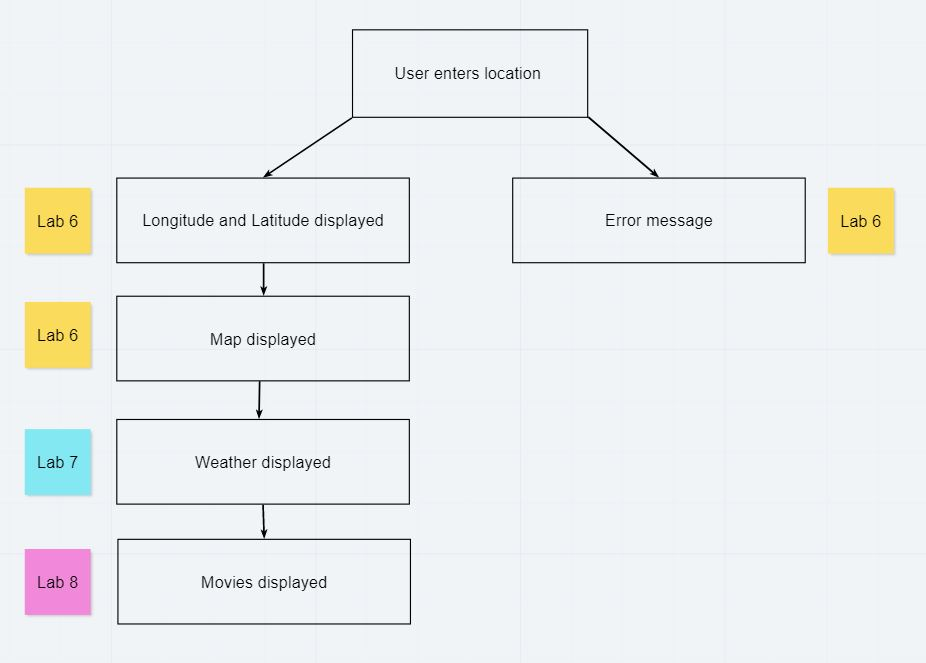
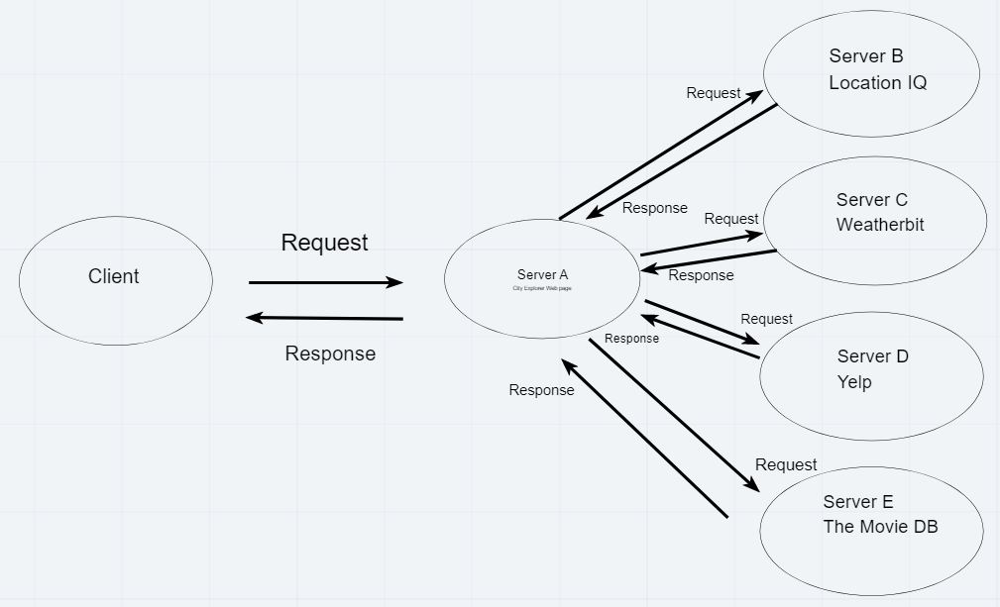
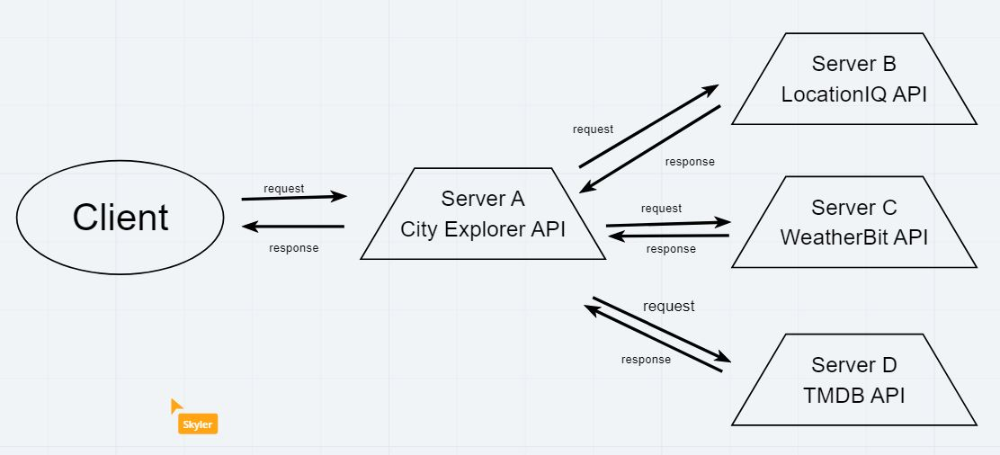
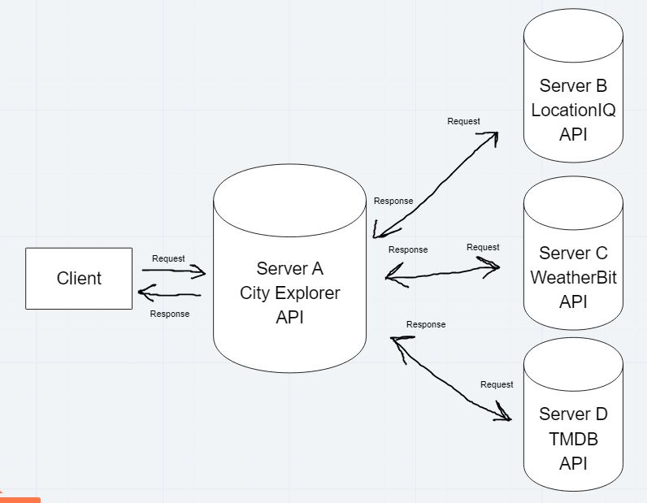

# City Explorer

**Author**: Tim Egorov
**Version**: 1.4.0 (increment the patch/fix version number if you make more commits past your first submission)

## Overview
This app allows a user to enter the name of a city, see the longitude/latitude of that city, and view a map of that location. The app will also display an error message, prompting the user to try again (or try entering a different query).

## Getting Started
`npm install` the cloned repo

## Architecture
JavaScript, React, Netlify, Bootstrap, Axios

## Change Log
<!-- Use this area to document the iterative changes made to your application as each feature is successfully implemented. Use time stamps. Here's an example: -->

04-19-2021 4:00pm - Application now allows a user to enter a location in a form, and upon submitting, displays the closest location's name, longitude, latitude, and a static map of the surrounding area. Also shows an error message.

4-20-2021 6:00pm - Application now renders a placeholder for weather below the map

4-21-2021 5:00pm - Application now renders dynamic weather below the map depending on the location entered by the user. The app also displays the top 20 movies with the city/area name in its title, along with the movie's popularity, name, and description.

4-22-2021 5:00pm - Application now lives online on deployed sites (netlify/heroku). Refactored to separate MovieDay and WeatherDay from Movie and Weather, respectively.

4-23-2021 5:00pm - Application now stores recently stored locations in local cache, preventing the browser from reaching out to the API if the same location has been searched in the past 5 seconds.

## Credit and Collaborations
Coded alongside my classmates in Code Fellows seatt-c-301d73

--- 
# Time Estimates

Name of feature: Adding locations, map, error

Estimate of time needed to complete: 3 hours

Start time: 1:30pm

Finish time: 5:00pm

Actual time needed to complete: 3 hours and 30 mins

//

Name of feature: Server setup

Estimate of time needed to complete: 1 hour

Start time: 2:00pm

Finish time: 3:00pm

Actual time needed to complete: 1 hour

//

Name of feature: Weather placeholder

Estimate of time needed to complete: 1 hour

Start time: 3:00pm

Finish time: 6:00pm

Actual time needed to complete: 3 hours

//

Name of feature: Dynamic weather

Estimate of time needed to complete: 1 hour

Start time: 2:00pm

Finish time: 4:00pm

Actual time needed to complete: 2 hours

// 

Name of feature: Movie search

Estimate of time needed to complete: 1 hour

Start time: 4:00pm

Finish time: 5:00pm

Actual time needed to complete: 1 hour

//

Name of feature: Deploying to Netlify/Heroku

Estimate of time needed to complete: 1 hour

Start time: 4:00pm

Finish time: 5:00pm

Actual time needed to complete: 1 hour

//

Name of feature: Stores recent searches to cache

Estimate of time needed to complete: 2 hour

Start time: 1:30pm

Finish time: 5:45pm

Actual time needed to complete: 4 hours and 15 minutes

--- 

# WRRC Image

# Getting Started with Create React App

This project was bootstrapped with [Create React App](https://github.com/facebook/create-react-app).

## Available Scripts

In the project directory, you can run:

### `npm start`

Runs the app in the development mode.\
Open [http://localhost:3000](http://localhost:3000) to view it in the browser.

The page will reload if you make edits.\
You will also see any lint errors in the console.

### `npm test`

Launches the test runner in the interactive watch mode.\
See the section about [running tests](https://facebook.github.io/create-react-app/docs/running-tests) for more information.

### `npm run build`

Builds the app for production to the `build` folder.\
It correctly bundles React in production mode and optimizes the build for the best performance.

The build is minified and the filenames include the hashes.\
Your app is ready to be deployed!

See the section about [deployment](https://facebook.github.io/create-react-app/docs/deployment) for more information.

### `npm run eject`

**Note: this is a one-way operation. Once you `eject`, you can’t go back!**

If you aren’t satisfied with the build tool and configuration choices, you can `eject` at any time. This command will remove the single build dependency from your project.

Instead, it will copy all the configuration files and the transitive dependencies (webpack, Babel, ESLint, etc) right into your project so you have full control over them. All of the commands except `eject` will still work, but they will point to the copied scripts so you can tweak them. At this point you’re on your own.

You don’t have to ever use `eject`. The curated feature set is suitable for small and middle deployments, and you shouldn’t feel obligated to use this feature. However we understand that this tool wouldn’t be useful if you couldn’t customize it when you are ready for it.

## Learn More

You can learn more in the [Create React App documentation](https://facebook.github.io/create-react-app/docs/getting-started).

To learn React, check out the [React documentation](https://reactjs.org/).

### Code Splitting

This section has moved here: [https://facebook.github.io/create-react-app/docs/code-splitting](https://facebook.github.io/create-react-app/docs/code-splitting)

### Analyzing the Bundle Size

This section has moved here: [https://facebook.github.io/create-react-app/docs/analyzing-the-bundle-size](https://facebook.github.io/create-react-app/docs/analyzing-the-bundle-size)

### Making a Progressive Web App

This section has moved here: [https://facebook.github.io/create-react-app/docs/making-a-progressive-web-app](https://facebook.github.io/create-react-app/docs/making-a-progressive-web-app)

### Advanced Configuration

This section has moved here: [https://facebook.github.io/create-react-app/docs/advanced-configuration](https://facebook.github.io/create-react-app/docs/advanced-configuration)

### Deployment

This section has moved here: [https://facebook.github.io/create-react-app/docs/deployment](https://facebook.github.io/create-react-app/docs/deployment)

### `npm run build` fails to minify

This section has moved here: [https://facebook.github.io/create-react-app/docs/troubleshooting#npm-run-build-fails-to-minify](https://facebook.github.io/create-react-app/docs/troubleshooting#npm-run-build-fails-to-minify)
